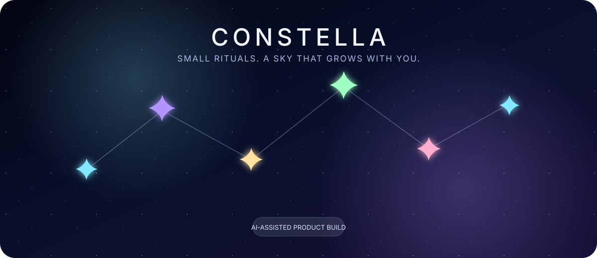
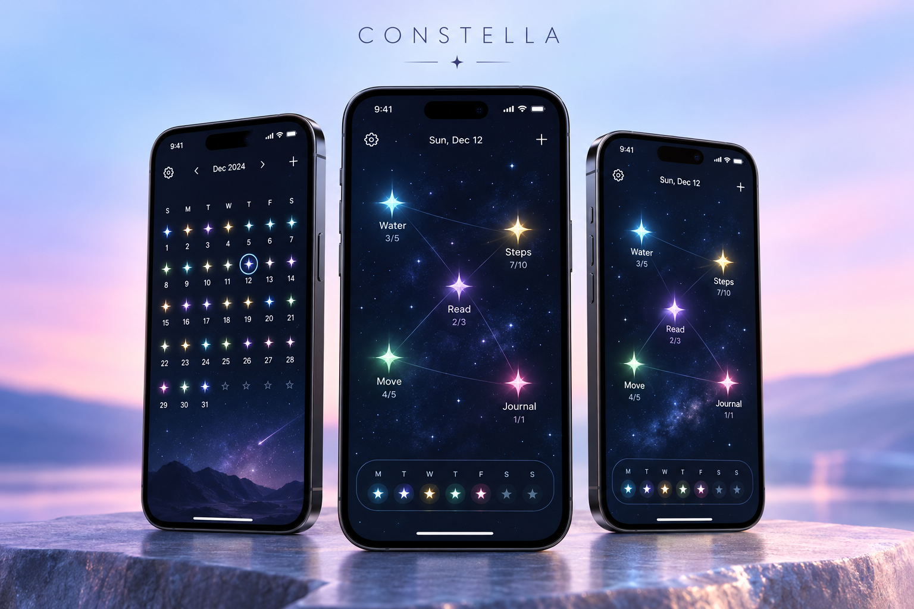
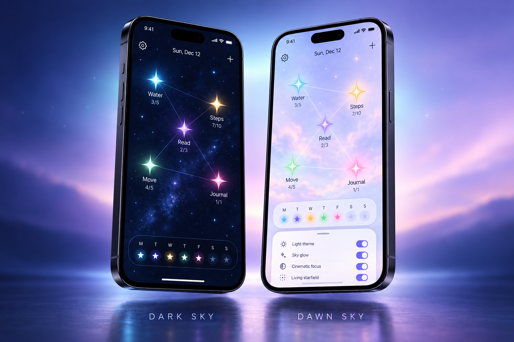

<p align="center">
  
</p>

<h1 align="center">Constella</h1>

<p align="center">
  A calm, mobile-first habit tracker that turns daily progress into a living constellation.
</p>

<p align="center">
  <a href="https://iahmed22.github.io/habit-tracker/"><strong>Live demo</strong></a>
  ·
  <a href="#ai-assisted-workflow">AI workflow</a>
  ·
  <a href="#run-locally">Run locally</a>
</p>

<p align="center">
  
  
  
  
</p>

## Product showcase

<p align="center">
  
</p>

<p align="center">
  
</p>

<p align="center"><sub>AI-generated product mockups created from the app’s visual system and interaction design.</sub></p>

## The idea

Most habit trackers feel like spreadsheets. Constella makes the same interaction feel more personal: every habit is a star, progress gives it light, and completed habits connect into a constellation in the order they were finished.

The interface is intentionally quiet. There are no dense tables on the dashboard, no accounts, and no setup process. Open the sky, choose a star, and record the day.

## Experience highlights

| Experience | How it works |
| --- | --- |
| **Living constellation** | Today’s habits appear as draggable stars whose size and brightness respond to progress. |
| **Rewarding completion** | Completed stars glow, animate, and connect in completion order with a drawn line animation. |
| **Flexible schedules** | Habits can run daily, on weekdays, on weekends, or on selected custom weekdays. |
| **Upcoming habits** | Off-day habits become smaller shooting stars that show when they return. |
| **Month and year history** | Each habit has a focused calendar where partial and complete days become stars. |
| **Retroactive logging** | Past scheduled days can be selected and updated without disrupting the dashboard. |
| **Tactile layout** | Press and hold to reposition stars; collision-aware placement keeps the constellation readable. |
| **Adaptive atmosphere** | The sky responds to completed habits, follows moved stars, and offers adjustable glow and motion. |
| **Dark and light themes** | Night and dawn palettes have distinct backgrounds, controls, and contrast treatments. |
| **Local-first persistence** | Habits, history, positions, and preferences are stored in the browser with `localStorage`. |

## AI-assisted workflow

Constella is an example of **human-directed, AI-assisted product development**. I used conversational AI as an implementation partner while retaining control over the product vision, interaction decisions, visual critique, and acceptance criteria.

The process was iterative:

1. **Defined the product metaphor** — habits as stars in a peaceful, euphoric night sky.
2. **Specified behavior in plain language** — quick logging, schedules, historical editing, streaks, and persistence.
3. **Reviewed each prototype visually** — identifying issues such as excessive framing, weak hierarchy, incorrect zoom centering, overlapping objects, and inaccessible contrast.
4. **Refined micro-interactions** — cinematic focus, press-and-hold dragging, haptic feedback, animated constellation lines, moving nebula glows, and shooting-star states.
5. **Tested edge cases through conversation** — target values of one, partial completion, off-schedule days, past-day edits, mobile boundaries, black stars, and reduced motion.
6. **Refactored the result** — separated structure, presentation, and behavior into maintainable project files.

This workflow demonstrates more than prompt generation: it shows how AI can be directed through concrete constraints, visual feedback, product judgment, and repeated verification to reach a coherent result.

## Technical decisions

- **Vanilla web platform:** No framework or build step; the project runs anywhere static files can be served.
- **Data model:** Each habit stores its target, schedule, history, color, streak, position, and completion metadata.
- **Calendar logic:** Schedule-aware month and year views hide irrelevant days and preserve partial values.
- **Collision system:** Rendered star artwork is measured in the DOM to prevent visual overlap while allowing close placement.
- **Responsive interaction:** Pointer events support mouse, pen, and touch with mobile-safe boundaries.
- **Progressive motion:** CSS animations provide feedback while respecting `prefers-reduced-motion`.
- **Privacy by default:** All data stays in the browser. There is no backend, analytics layer, or account system.

## Project structure

```text
habit-tracker/
├── index.html                  # Semantic application structure
├── assets/
│   ├── css/
│   │   └── styles.css          # Themes, responsive layout, and animation
│   ├── images/
│   │   ├── constella-device-showcase.png
│   │   ├── constella-theme-showcase.png
│   │   ├── favicon.svg
│   │   └── readme-hero.svg
│   └── js/
│       └── app.js              # State, rendering, calendar, and interactions
├── .gitignore
└── README.md
```

## Run locally

No installation is required.

1. Clone the repository:

   ```bash
   git clone https://github.com/iahmed22/habit-tracker.git
   cd habit-tracker
   ```

2. Open `index.html` in a modern browser.

For a local development server, you can also use VS Code’s **Live Server** extension or run:

```bash
python -m http.server 8000
```

Then visit `http://localhost:8000`.

## Deploy with GitHub Pages

1. Open the repository’s **Settings**.
2. Select **Pages**.
3. Choose **Deploy from a branch**.
4. Select `main` and `/ (root)`.
5. Save and wait for the deployment link to appear.

## Browser support

Constella targets current versions of Chrome, Edge, Firefox, and Safari. The interface uses modern CSS features such as `color-mix()`, backdrop filters, and the `:has()` selector.

## Future directions

- Export and import habit data
- Optional cloud synchronization
- Installable PWA support
- More constellation layouts and accessibility controls
- Automated interaction and visual regression tests

---

<p align="center">
  Designed as a study in calm interaction, visual feedback, and thoughtful AI collaboration.
</p>
